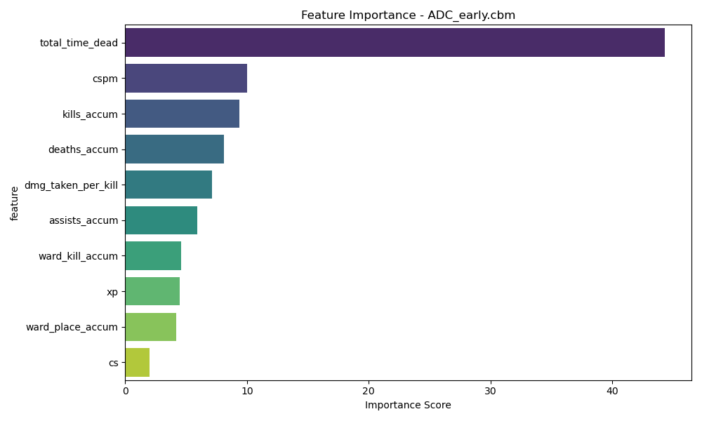
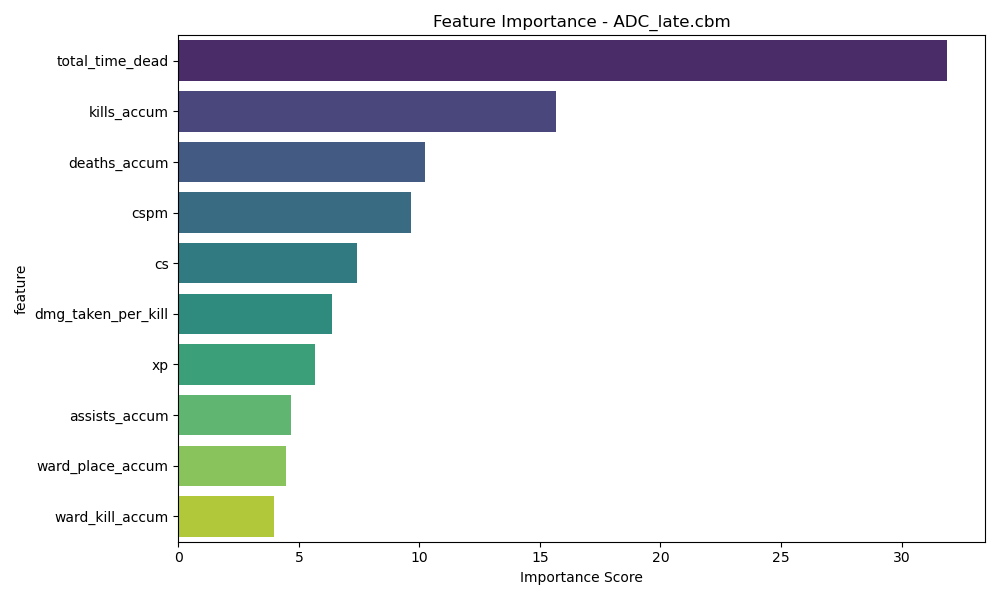
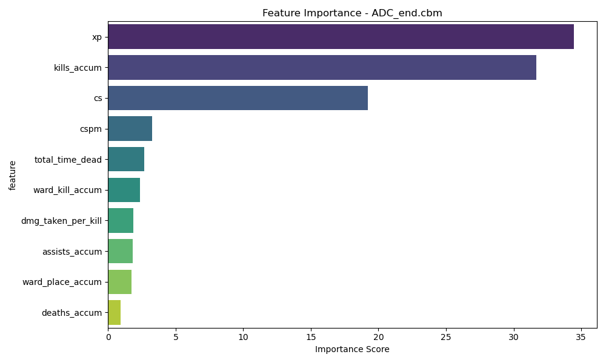
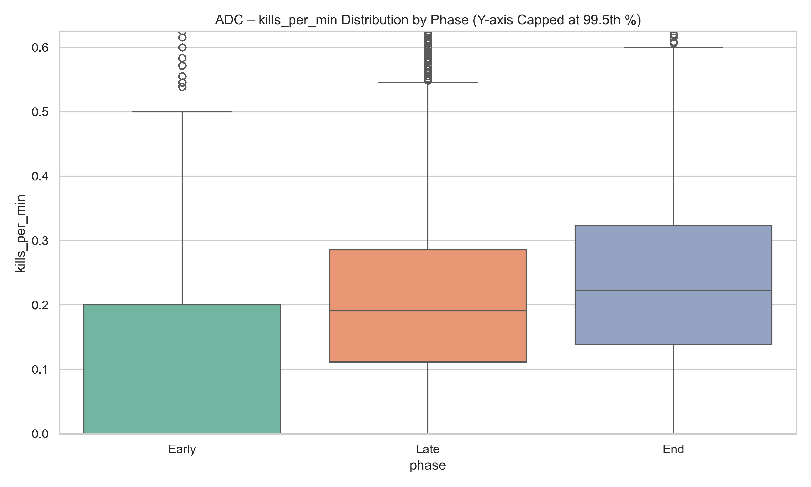
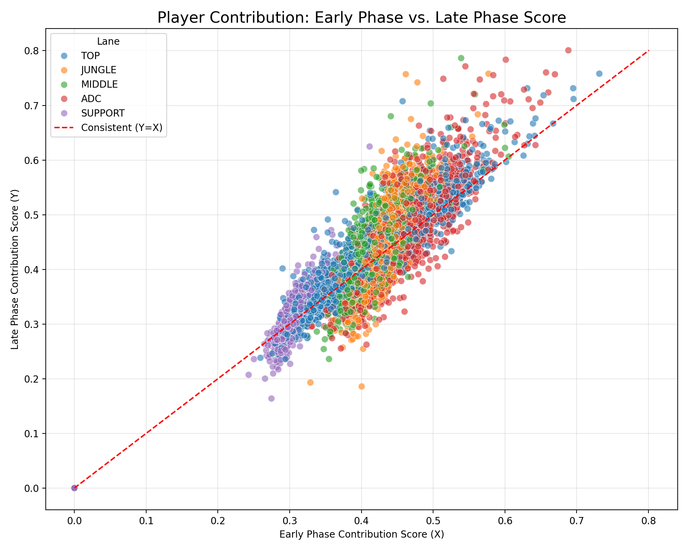
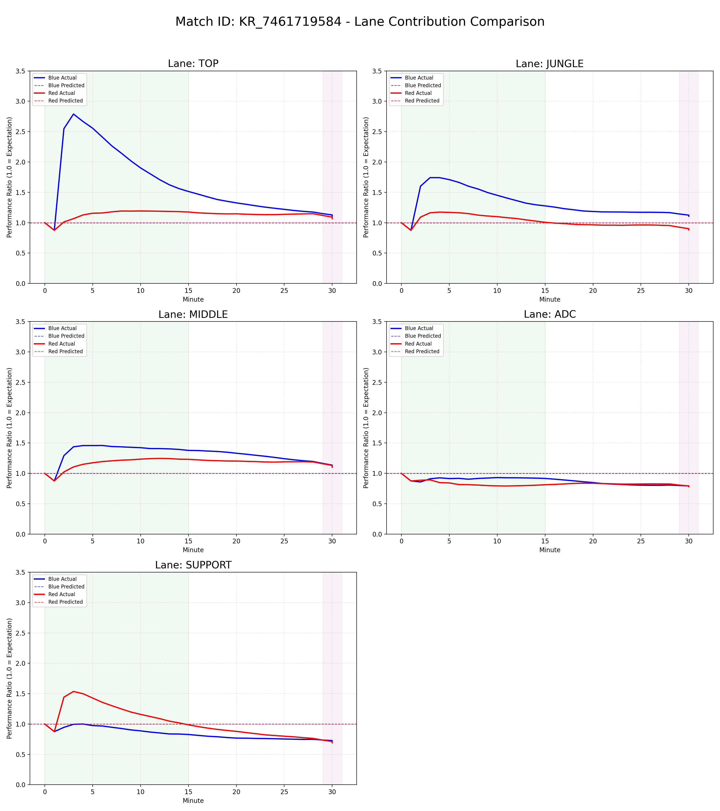
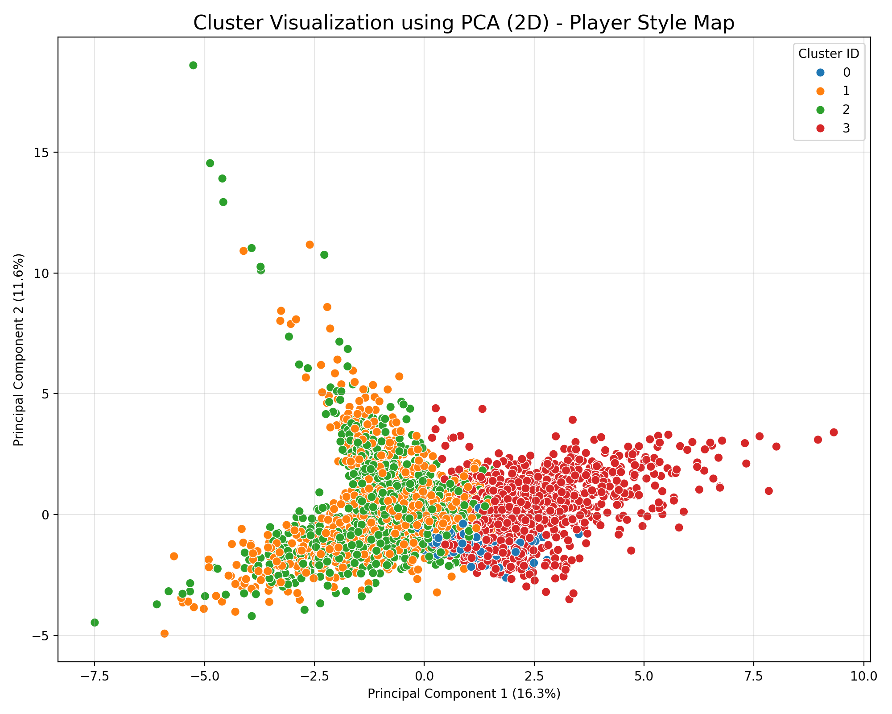
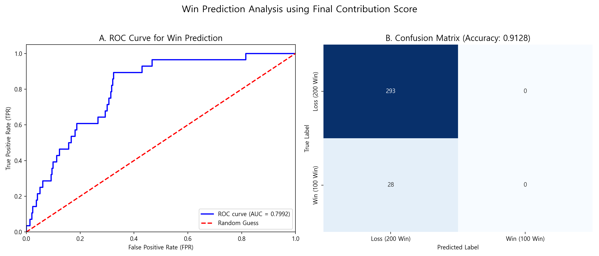

# 🎮 LOL Hybrid Project

------------------------------------
## 하이브리드 기여도 모델 (Manual Weight + CatBoost Residual)

## 1. 프로젝트 개요

이 프로젝트는 리그 오브 레전드(LoL) 플레이어의 **기여도(Contribution Score)**를  
“한 시점에서만 평가하는 기존 OPScore 모델의 한계”를 넘어서기 위해 설계한  
**시간 기반(Time-Split) + Hybrid Weighting 모델**이다.

특히 1000개 이상의 매치 데이터를 기반으로,  
플레이어의 행동을 **시간 흐름에 따라 다르게 해석할 수 있는 구조**를 만드는 것이 핵심이다.

---

## 2. 이 프로젝트의 가장 큰 차별점 (KEY POINTS)

### ✔ A. 0~15분 / 15분 이후 / 종료 시점 → **3단계 Time-Split 모델**
- LoL에서는 초중후반에 같은 행동이라도 “가치”가 달라진다.
- 그래서 모든 라인을 **Early / Late / End** 세 구간으로 나누고  
  각 구간별로 **별도의 CatBoost 모델**을 학습시켰다.
- 이를 통해 **시간 흐름에 따른 기여도 변화를 시계열처럼 추적**할 수 있다.

### ✔ B. “직접 가중치 + CatBoost 자동 가중치”를 합친 **Hybrid 모델**
- Y값이 Gold라서, “골드와 직관적으로 연결된 피처”들에만 가중치가 몰리는 구조를 방지하기 위해  
  일부 피처는 **수작업 가중치(Manual Weight)**를 설정했다.
- 나머지 피처는 CatBoost의 자동 Feature Importance로 학습된다.
- 그래서 “골드와 직접 상관 없는 중요한 행동(무빙 압박, 시야 잡기, 생존 시간 등)”까지 점수화된다.

즉,
> **직접 중요하다고 판단한 피처를 사람이 먼저 잡아주고,  
> 모델은 그 외의 패턴을 자동으로 찾아가는 구조**이다.

### ✔ C. 원래 교수님은 ‘원딜+서폿 묶어서 모델 하나 만들라’고 했음  
근데 우리는 아예 **서폿을 역할군 4개로 분리해서 모델을 따로 만들었다.**
- Support는 다른 라인과 달리 챔피언 역할 편차가 극단적으로 크다.  
  (탱커 / 유틸 / 딜러 / 이니시 / 암살 등)
- 그래서 서폿을 크롤링해 **4개 대분류로 직접 전처리**했고,
  Support 라인도 **역할군별로 각각 early/late/end 모델**을 따로 학습시켰다.

이건 기존 OPScore나 퍼블릭 프로젝트에도 거의 없는 방식이다.

### ✔ D. End Phase에서는 match.json의 “정적 피처”도 모델에 포함 가능
- 종료 시점은 시간 흐름의 중요도가 낮아지고,
- 오히려 **game-end snapshot 데이터** 활용이 의미 있다.
- 타워 피해량, 오브젝트 처치, 최종 KDA 등  
  정적 피처를 End 모델에서만 추가로 활용 가능 → 시계열이 훨씬 정교해짐.

---

###  데이터 구조 및 전체 파이프라인

```
timeline.json → minute-level transform  
 → early/late/end 분할  
 → lane-role classification  
 → manual weights 적용  
 → CatBoost train  
 → prediction merge  
 → final OPScore-like contribution score
```

### (1) 라인 확정
- match.json의 participantId 기반으로 lane 확정

### (2) 시간 단위 분리
- Early:   0 ~ 15분  
- Late:    15분 이후 ~ 거의 끝  
- End:     match.json 기반 정적 스냅샷

### (3) 수작업 가중치 적용
- 내가 중요하다고 판단한 피처만 선별해서  
  early/late/end 구간별로 각각 다른 가중치를 부여
- 피처 예시  
  - TOP → 스플릿푸시 체류시간, 타워딜, 솔킬 기여  
  - MID → 로밍 KA, 라인 압박, DPM  
  - JUNGLE →  갱킹 KA, 오브젝트  
  - ADC → 생존시간, 한타 DPM, CS PM  
  - SUPPORT → 역할군별로 피처 세트 다르게

### (4) CatBoost 자동 가중치
- manual weight로 전체 feature weight를 1.0 중 일부만 사용  
  나머지는 CatBoost에서 자동으로 피처 중요도를 학습

예:
```
manual weight = 0.2  
→ 나머지 0.8은 CatBoost automatic learning
```

### (5) 예측값 병합
- early 모델 예측값 → 초반 분  
- late 모델 예측값 → 중후반 분  
- end 모델 예측값 → 게임 끝 스냅샷  
- 이 3개 모델의 예측을 시간축 위에서 이어 붙여서  
  “게임 전체의 시계열 기여도 그래프”를 만든다.

---

### 서포터 모델을 4개의 역할군으로 분리

대부분은 바텀(ADC+SUP)을 하나로 묶지만,  
서폿 역할군이 너무 다양하다는 점을 문제로 봤다.

그래서 직접 크롤링 후 support_role.py로 네 가지 역할로 분리했다.

- Enchanter  
- Tank  
- Mage(딜서폿)  
- Assassin(픽형)  

이 작업 덕분에 원딜과 서폿을 분리하여 모델링할 수 있었고  
해석력이 크게 향상됐다.

---
## 4. 라인별 Manual Feature 선정 이유  
본 프로젝트에서는 모든 라인을 **Early(0~15분) / Late(15분 이후) / End(종료 시점)**으로 구분하여  
시간대별로 실제 기여가 달라지는 LoL 구조를 반영하도록 설계했다.

Manual Feature는 “챌린저 표본 분석 + 라인 역할 + 시간대별 중요도 변화”를 기준으로  
**직접 가중치를 부여한 피처**이며, 나머지는 CatBoost가 자동으로 가중치를 학습한다.

---

# 🟥 TOP (탑)

## ■ 공통 + 고유 Manual Feature
| 피처 | 선정 이유 |
|------|-----------|
| CS | 라인전 단계에서 골드 수급의 가장 기본이 되는 지표로, CS 우위는 곧 아이템 우위로 직결된다. |
| XP | 레벨 차이는 솔킬/교전 결과에 직접적인 영향을 준다. |
| DPM | 초중반보다 **후반 교전 기여도**를 수치화할 때 중요한 지표. |
| Kills / Assists | 상체 교전이 빈번한 탑에서 K/A는 스노우볼 형성의 핵심 요인. |
| Deaths | 탑의 과도한 데스는 사이드 압박 불가 → 전체 템포 붕괴로 이어진다. |
| 포탑 방패 수 | 라인전을 이기고 있다는 “경제적 증거”이기 때문에 직접 가중치 부여. |
| 타워 철거 참여 | 스플릿 운영의 구체적 성과를 보여주는 핵심 지표. |
| 데스당 받은 피해량 | 탱커 기반 챔피언일 경우 효율적 탱킹 여부를 판단하는 핵심 지표. |
| 스플릿 푸쉬 시간 | TOP 라인의 정체성을 결정하는 가장 중요한 운영 지표. |
| 솔로킬 | 라인전 영향력/순수 스킬 기반 우위를 설명하는 핵심 피처. |

## ■ 시간대 선택 Manual Feature
| 시간대 | 피처 | 선정 이유 |
|--------|------|-----------|
| Early | 솔로킬 | 초반 탑 라인전 우위는 게임 전체 흐름을 뒤흔든다. |
| Late | 스플릿 푸쉬 시간 | 중후반 사이드 압박력은 탑의 핵심 역할이라 반드시 반영해야 한다. |
| End | 분당 타워 피해량 | 스플릿·운영의 최종 성과를 보여주는 가장 명확한 지표. |

---

# 🟩 MID (미드)

## ■ 공통 + 고유 Manual Feature
| 피처 | 선정 이유 |
|------|-----------|
| CS / XP | 미드 주도권 확보의 핵심. CS·레벨 우위는 로밍 가능성을 열어준다. |
| DPM | 미드는 포킹/교전 중심 라인으로 DPM은 영향력 판단의 기준. |
| Kills / Assists | 게임 중반 이후 교전 설계·참여 핵심. |
| Deaths | 미드 데스는 곧 **팀 전체 시야 붕괴**로 이어진다. |
| 로밍 킬/어시 | 미드의 맵 주도권 지표 중 가장 직접적인 수치. |
| 시야 효율 | 미드는 강가 두 개를 모두 관리해야 하기 때문에 시야 효율을 직접 반영. |
| 포탑 방패 | 초반 압박력의 대표 지표. |

## 시간대 Manual Feature
| 시간대 | 피처 | 선정 이유 |
|--------|------|-----------|
| Early | 로밍 K/A | 초반 미드의 로밍 성공 여부는 모든 라인에 영향을 준다. |
| Late | 킬관여율 | 미드가 후반 교전에 얼마나 개입하는지 직접 반영. |
| End | DPM | 미드 후반 딜링이 게임 결과에 가장 큰 영향을 주는 부분. |

---

# 🟫 JUNGLE (정글)

## ■ 공통 + 고유 Manual Feature
| 피처 | 선정 이유 |
|------|-----------|
| jungle CS | 정글 성장 속도와 동선 효율을 수치화하는 기본 지표. |
| XP | 정글 레벨 우위는 갱킹/1대1/오브젝트 경쟁력에 직접 영향. |
| DPM | 특정 메타(갱킹형/파밍형)에 따라 다르지만 late 기여도를 반영하기 위해 포함. |
| ward_placed / removed | 오브젝트 컨트롤과 라인 안정성을 모두 반영. |
| Deaths | 정글의 데스는 **오브젝트 경쟁력 필패**로 이어진다. |
| 갱킹 Kill + Assist | 정글 기여도의 핵심. 라인 스노우볼을 직접적으로 만든다. |
| 오브젝트 처치 | 정글 영향력의 종합 평가 지표. |

## 시간대 Manual Feature
| 시간대 | 피처 | 선정 이유 |
|--------|------|-----------|
| Early | 갱킹 K/A | 초반 정글은 갱킹 성공 여부로 영향력이 확정된다. |
| Late | 킬관여율 | 중후반 교전에서 정글러가 얼마나 기여하는지 평가. |
| End | 오브젝트 처치 | 게임 결과에 직결되는 최종 영향력. |

---

# 🟦 ADC (원딜)

## ■ 공통 + 고유 Manual Feature
| 피처 | 선정 이유 |
|------|-----------|
| CS | 원딜 성장의 절대적 기준. CS 우위는 곧 아이템 파워 우위. |
| XP | 라인전 단계 유지력·딜교환 우위 확인 가능. |
| DPM | 원딜 기여도 판단의 핵심. |
| Deaths | 원딜이 죽으면 한타가 종료되므로 치명적 지표. |
| 킬당 받은 피해량 | 포지셔닝 능력의 핵심. 잘 포지션한 ADC는 받은 피해량이 낮다. |
| 데스당 넣은 피해량 | 죽더라도 딜을 얼마나 뽑았는지 보는 지표. |
| 리스폰 시간 | 후반에서 리스폰 시간은 팀 전력 공백을 의미한다. |

## 시간대 Manual Feature
| 시간대 | 피처 | 선정 이유 |
|--------|------|-----------|
| Early | CS 분당 | 원딜 초반 성장 지표의 절대 기준. |
| Late | 총 죽어있던 시간(또는 생존 시간) | 원딜 생존은 팀 DPS의 존속 여부를 결정한다. |
| End | 한타 피해량 | 원딜의 ‘실제 캐리력’을 수치로 보여주는 핵심 지표. |

---

# 🟪 SUPPORT (서포터) – 역할군별 Manual Feature

## 6-1) Enchanter
| 피처 | 선정 이유 |
|------|-----------|
| Heal per Minute | 유지력 중심 유틸 서폿의 핵심 지표. |
| Vision Score | 시야 장악·맵 안정성의 기반. |
| 어시스트 | 교전 보조 능력. |
| 로밍 K/A | 유지력·보조 기반 로밍 기여 반영. |

## 6-2) Tank Support
| 피처 | 선정 이유 |
|------|-----------|
| CC 시간 | 이니시에이팅의 핵심 지표. |
| Damage Taken | 탱커 역할의 직접적 성능. |
| 로밍 기여 | 초중반 교전 설계 능력. |

## 6-3) Mage Support
| 피처 | 선정 이유 |
|------|-----------|
| DPM | 포킹·딜링 기여의 핵심. |
| 견제 성공률 | 라인전 압박력. |
| Vision Score | 안정적인 포킹 구조를 유지하기 위한 필수 지표. |

## 6-4) Assassin/Playmaker Support
| 피처 | 선정 이유 |
|------|-----------|
| Kill (픽 기여) | 적 잘라먹기·변수 창출 핵심. |
| CC 활용 | 교전 개시 지표. |
| 로밍 성공률 | 초중반 변수 생성 능력. |


#### Split Push 
스플릿 푸쉬같은 경우는 롤에 특히 탑에 굉장히 중요한 지표이다 그러나 직접적인 피쳐값이 없기에 이걸 바로 사용할 순 없다
그래서 추출해서 사용해야 하는데 좌표값 힘들게 찾아내어 해결하였다.
#### 스플릿 푸시 Feature 추출 방식

스플릿 푸시 시간(Split Push Time)은  
**timeline.frames 내의 플레이어 좌표(x, y)를 기반으로 특정 라인 구역에 머무른 시간을 누적하는 방식**으로 계산하였다.

LoL에서 실제 좌표는 미니맵에 표시되는 축척과 달라  
원본 미니맵 기준 좌표를 → 실 게임 좌표 범위로 변환(Scaling) → 각 라인의 억제기(inhibitor)까지 확장된 구역을 설정한 뒤  
플레이어가 해당 구역 안에 체류한 시간을 카운트하였다.

---

##  1) 미니맵 원본 좌표 범위 정의

원래 제공된 미니맵 기반 범위는 다음과 같다.

- **Top lane (미니맵 스케일):**  
  (20~60, 30~220), (20~150, 20~160), (30~200, 20~60)
- **Bot lane (미니맵 스케일):**  
  (310~460, 435~485), (400~490, 385~480), (440~490, 310~455)

이 좌표들은 모두 **미니맵 기준 상대적 위치**이기 때문에  
스플릿 푸시를 정확히 판별하기에는 범위가 좁고 축척 차이가 존재한다.

---

# 🗺️ 2) 실 게임 좌표계로 스케일링(Scaling)

게임 내 timeline.frames → position.x / position.y 좌표는  
**수천~만 단위의 실제 맵 좌표를 사용**하므로  
이를 미니맵 좌표와 직접 비교할 수 없다.

따라서 각 lane 영역을 게임 내부 좌표 스케일에 맞게 변환해  
아래와 같은 **확장된 라인 경로(라인 → 억제기 구간)**를 정의하였다.

```
"top_range_inhibitor": [
  { "x": [586, 2111],  "y": [8555, 14120] },
  { "x": [586, 4395],  "y": [10313, 14355] },
  { "x": [879, 5860],  "y": [12758, 14355] }
],
"bot_range_inhibitor": [
  { "x": [1284, 13477], "y": [352, 11324] },
  { "x": [1284, 14355], "y": [469, 11324] },
  { "x": [1284, 14355], "y": [1629, 11324] }
]
```

각 구역은 “미니언 웨이브가 지나가는 정규 라인 + 억제기(inhibitor)까지 이어지는 전체 경로”를 커버하도록 설정하였다.

---

# 🕒 3) 플레이어의 좌표를 기준으로 체류 시간 계산

timeline.frames는 1분마다 모든 플레이어의 좌표를 제공한다.

스플릿 푸시 시간 계산 방식은 다음과 같다.

1. 각 분(frame)에서 플레이어의 `(x, y)` 좌표를 읽는다.  
2. 해당 좌표가  
   - top_range_inhibitor  
   - bot_range_inhibitor  
   중 하나에 포함되는지 확인한다.
3. 포함될 경우 “스플릿 푸시 구간에 머무른 1분”으로 카운트한다.
4. 모든 frame을 누적하여  
   **Split Push Time = (해당 라인 경로에 머문 총 시간)** 을 얻는다.

※ 탑/바텀 중 *적팀의 구역*에만 스플릿 푸시 판정 적용.

---

# 📌 최종 산출 값: Split Push Time (분 단위)

이렇게 산출된 Split Push Time은  
- TOP Late Model의 핵심 피처  
- 운영형 챔피언(케넨, 트런들, 피오라 등)의 기여도 판단  
- 타워 피해량·억제기 압박 수치와도 상관관계가 높음  

이라는 이유로 **Manual Weight가 직접 적용된 주요 지표**이다.


---

# 📌 2. 모델 선정 (Model Selection)

본 프로젝트의 목적은 *라인별 기여도(Contribution Score)를 시간 흐름(Early / Late / End)에 따라 정교하게 예측하는 것*이며,   
이를 위해 **Hybrid Manual Weight + CatBoost 모델 구조**를 사용하였다.

---

# 🧩 2.1 모델 구조 개요

본 모델은 다음과 같은 방식으로 구성된다.

- **Early / Late 모델**  
  `0.1 * Manual(Early/Late Feature) + 0.9 * CatBoost(Early/Late Feature Importance)`

- **End 모델**  
  `0.2 * Manual(End Feature) + 0.8 * CatBoost(End Feature Importance)`

여기서 Manual Weight는  
“시간대별로 내가 특히 중요하게 생각한 피처”에 직접 가중치를 주는 방식이며,  
나머지 80~90%의 가중치는 CatBoost가 자동으로 학습한다.

결과적으로 모델은  
- **사람의 도메인 지식(Manual) 10~20%**  
- **머신러닝의 패턴 학습(CatBoost) 80~90%**  
을 결합한 *Hybrid Weighted Model*이다.

---

# 🧠 2.2 CatBoost를 모델로 선정한 이유

### ✔ 1) LoL 피처 특성과 가장 잘 맞음  
LoL 데이터는  
- 정규화 범위가 다르고  
- 범주형 + 연속형 피처가 섞여 있고  
- Early/Late/End의 데이터 밀도가 다르고  
- 상호작용이 매우 다양함  

CatBoost는  
- One-Hot Encoding이 필요 없는 Tree 기반  
- 비선형 관계 학습에 매우 강함  
- 작은 데이터셋(1,000판 수준)에서도 안정적 성능  
- 시간대별 피처 중복에도 강한 Regularization  
을 가지고 있어 LoL 데이터 특성과 가장 잘 맞는 모델이다.

### ✔ 2) "설명력 대비 과적합 위험이 낮음"  
XGBoost는 성능은 높지만  
Early/End와 같이 데이터 변동이 심한 페이즈에서 과적합 위험이 컸다.

반면 CatBoost는  
- Ordered Boosting  
- Robust한 Loss  
덕분에 **변동성이 큰 LoL 페이즈 데이터(Early/End)를 다룰 때 안정성이 높았다.**

### ✔ 3) Manual Weighting과 결합했을 때 가장 자연스러운 성능  
너는 특정 피처(솔로킬, 스플릿퓨시, 로밍 K/A 등)에  
*직접 가중치를 주는 방식*을 선택했다.

CatBoost는  
이런 “Bias가 있는 입력값”과도 시너지가 나기 때문에  
Manual Weight 10~20%를 얹는 구조가 매우 잘 들어맞았다.

---

# 🔗 2.3 Hybrid Manual Weight 모델을 만든 이유

Hybrid 모델은 **사람이 아는 ‘롤의 구조적 중요도’와  
머신러닝이 포착하는 ‘패턴 기반 중요도’를 결합하기 위한 목적**으로 설계되었다.

즉, LoL이 “수치가 전부가 아닌 게임”이기 때문이다.

### ✔ 1) LoL에는 “수치로 보이지 않는 기여도”가 존재함  
예:  
- 잘못된 포지셔닝으로 팀 전체가 손해보는 구조  
- 서폿의 로밍 보조  
- ADC의 생존 시간이 한타 결과를 결정  
- 탑의 스플릿 압박이 상대 동선을 묶음

이런 피처들은 raw feature 중요도만으로는 절대 반영되지 않는다.

그래서 직접 가중치를 넣었고,  
이를 CatBoost의 학습과 결합했다.

### ✔ 2) Early/Late/End는 중요 피처가 달라진다  
예를 들어  
- Early = 솔로킬, 로밍 K/A, 갱킹 성공률  
- Late = DPM, Vision, 생존 시간  
- End = 타워 피해량, 오브젝트 기여, 리스폰 시간  

이런 구조적 변화는  
**단일 모델**로는 절대 학습이 되지 않기 때문에  
3단계로 모델을 쪼개고 Hybrid로 연결했다.

### ✔ 3) End 페이즈는 match.json 정적 데이터 사용 가능 → 큰 장점  
End에서는  
- 최종 골드  
- 최종 데스  
- 최종 DPM  
- 타워 피해량  
- 오브젝트 기여  

등 정적인 데이터가 추가로 사용 가능하다.

즉, End 모델에서 Manual Weight 20%를 사용한 이유는  
“정적인 데이터 기반으로 경기 결과를 더 정확히 판단하기 위함”이다.

---

# ⭐ 2.4 Hybrid 구조의 장점

| 장점 | 설명 |
|------|------|
| 시간대별로 달라지는 LoL 메커니즘을 반영 | Early = 라인전, Late = 교전, End = 운영/오브젝트 |
| 사람이 아는 LoL 도메인 지식을 모델에 주입 | 솔킬, 스플릿푸시, 시야 컨트롤 같은 “문맥적 중요도” 반영 |
| CatBoost가 나머지 중요도를 자동 보정 | Manual Weight의 부족함을 CatBoost가 보완 |
| End 페이즈에서 match.json 정적 정보 활용 가능 | 기존 OPScore 방식에서는 불가능한 장점 |
| 최종 Hybrid Score를 시간축으로 매끄럽게 연결 가능 | 타임라인 기여도 곡선(match curve) 생성 가능 |

---

# 🧩 2.5 이 모델 선정 방식이 최종적으로 얻은 효과

1. “초반 영향력(Early)”과 “후반 캐리력(Late/End)”을 분리함으로써  
   **라인마다 역할이 구조적으로 다름을 반영한 모델링이 가능해졌다.**

2. Manual Weight 10~20%로  
   **LoL 도메인 지식이 AI로 자연스럽게 주입되는 구조**를 만들었다.

3. CatBoost 80~90%로  
   **머신러닝 패턴이 사람의 bias를 자동으로 보정**해  
   전체적으로 균형 잡힌 모델을 만들었다.

4. 최종 Hybrid Score는 단일 시점 평가(OPScore)와 달리  
   **시간 흐름에 따른 기여도 그래프(match curve)를 만들 수 있게 해줬다.**


# 5. 시각화 결과 및 그래프 해석

---

## 📊 (1) Feature Definition Radar  
**파일:** `feature_definition_radar.png`  


**이 그래프가 말하는 것**  
- 라인별로 어떤 피처를 강조했는지 한눈에 보인다.  
- Manual Weight 선정 근거를 직관적으로 설명할 수 있다.  
- 특히 Support 4역할군 간 차이가 명확히 드러난다.

---

## 📊 (2) CatBoost Feature Importance  
**파일:** `feature_importance/<lane>_<phase>.png`  



**이 그래프가 말하는 것**  
- CatBoost가 실제로 어떤 피처의 중요도를 높게 평가했는지 보여준다.  
- 사람이 준 manual weight가 실제 모델 구조와 충돌하는지/시너지가 나는지 확인 가능.  
- early/late/end 별로 피처 중요도가 완전히 달라진다는 점이 증명됨.

---

## 📊 (3) Feature Distribution Plot  
**파일:** `distribution/<lane>_<feature>_boxplot.png`  

**이 그래프가 말하는 것**  
## 1. **3구간 모델(Time-based Model)의 필수성 입증**

ADC의 **Kills/min(분당 킬 기여)** 분포는  
- **Early(0~15분)**: 거의 0에 수렴  
- **Late(15분 이후)**: 점진적 상승  
- **End(종료 직전)**: 급격한 분산 증가  

이 패턴은 시간대별로 **데이터의 스케일(Scale)**과  
**기준선(Baseline) 자체가 전혀 다름**을 의미한다.

➡️ 따라서 **단일 모델이 아닌 Early / Late / End 개별 모델 학습이 필수**임을 통계적으로 증명한다.  
(= 너의 Time-based 3 Model 구조가 정당함)

---

## 2. **ADC(원딜)의 성장 곡선과 캐리력 시각화**

### ✔ Early 단계  
- 중앙값(Median)이 거의 **0에 붙어 있음**  
- 교전보다 **생존·CS 기반 성장**이 핵심  
- 원딜 특유의 “초반 약함(weak early game)”이 그래프에 그대로 드러남
### ✔ Late 단계  
- 박스(IQR)가 넓어지고 값의 분산이 증가  
- 팀의 상황·템파워·포지셔닝에 따라 성능 차이가 벌어지기 시작
### ✔ End 단계  
- 상단으로 뻗는 긴 whisker  
- 팀파이트/오브젝트 교전 중심으로 Kill/min 폭발  
- “잘 큰 원딜”과 “못 큰 원딜” 격차가 극단적으로 벌어짐
➡️ 이는 **ADC는 시간대에 따라 역할이 급격히 달라지는 라인**이라는 점을 수치로 보여준다.
## 3. **이상치(Outlier)가 아닌 ‘슈퍼 플레이’**

그래프 최상단에 찍힌 수많은 점들은  
- 데이터 오류가 아니라  
- **진짜 존재하는 하드 캐리(Hard Carry) 플레이**


---

## 📊 (4) Early vs Late Comparison  
**파일:** `phase_comparison/early_vs_late_score.png`  

**이 그래프가 말하는 것**  
- 각 플레이어가 초반형인지 후반형인지 즉시 파악 가능  
- 정글·미드·서폿은 Early 기여가 높고 원딜은 Late 기여가 높은 정상적인 LoL 메타 구조가 드러남  
- 동일 라인 내에서도 스타일 차이가 극명하게 갈림

---

## 📊 (5) Match Curve (EWMA 시계열 기여도)  
**파일:** `match_curve/match_<id>_ratio.png`  

**이 그래프가 말하는 것**  
- 해당 경기에서 각 라인이 시간대별로 얼마나 기여했는지 직관적으로 보여줌  
- 오브젝트·갱킹·한타 타이밍이 기여도 그래프에 정확히 반영됨  
- 게임 전환점(turning point)을 분석하기 좋음

---

## 📊 (6) Match Pair Curve (양 팀 라인 비교)  
**파일:** `match_pair_curve/match_<id>.png`  

**이 그래프가 말하는 것**  
- 같은 시간대에 Blue/Mid vs Red/Mid 기여도 비교 가능  
- 특정 시간 이후 어느 라인이 캐리했는지 명확히 드러남  
- 승패를 설명하는데 매우 강력한 시각화

---

## 📊 (7) PCA Cluster Map  
**파일:** `clustering_pca/pca_cluster_map.png`  

**이 그래프가 말하는 것**  
- 플레이 스타일(안정형, 폭발형, 성장형 등)을 라벨 없이도 자연스럽게 클러스터링  
- 시간대별 기여 패턴이 구조적으로 묶인다는 것을 확인  
- role 구분 없이도 정글/미드처럼 비슷한 패턴끼리 모임

---

## 📊 (8) Summoner Consistency  
**파일:** `consistency/<puuid>.png`  

**이 그래프가 말하는 것**  
- 소환사의 기여도 안정성을 측정  
- 승리 경기일 때 평균이 높아지는지/기복이 심한지 확인 가능  
- 롤스타급 유저는 그래프가 “1.0 근처에서 평탄하게 유지됨”

---

## 📊 (9) WinPrediction Analysis  
**파일:** `win_prediction/win_prediction_analysis.png`  

**이 그래프가 말하는 것**  
- 기여도 평균만으로도 승패 예측 기반이 형성됨  
- OPScore가 단순 KDA보다 훨씬 승패와 상관관계 높음을 보여줌


---
# 📌 7. 개선 방향 (Future Improvements)

본 프로젝트는 Early / Late / End 3단계 모델링과 Manual Weight 기반의 Hybrid 구조를 통해  
라인별 기여도를 효과적으로 예측할 수 있었다.  
그러나 LoL의 역할·챔피언 구조는 매우 복잡하며, 다음과 같은 개선 여지가 존재한다.

---

## 1) Feature를 더욱 세밀하게 확장하기

현재 Feature Set은  
- CS  
- XP  
- Vision  
- Kill / Assist  
- DPM  
- Split Push / Roaming  
등 핵심 지표 중심으로 구성되어 있다.

하지만 실제 경기 영향력은 다음과 같은 더 미묘한 신호들도 포함한다.

- 위치 정보 기반 **전투 회피(avoidance pattern)**  
- 스킬 사용 패턴(쿨타임 관리)  
- 시야가 닿지 않는 지역의 **리스크 행동(Risk-taking Behavior)**  
- 팀 내 상대적 골드 비중(Gold Share)  
- 동일 시간대 라인 간 영향(라인 간 상호작용)

➡️ 이러한 행동 기반 Feature를 추가하면  
**챔피언 개별 플레이 스타일까지 반영한 모델 정확도 상승**이 기대된다.

---

## 2) Support처럼 “다른 라인도 챔피언 역할군별로 세분화”

Support 라인은  
- Enchanter  
- Tank  
- Mage  
- Assassin/Playmaker

4개 역할군으로 나누었을 때 모델 성능이 유의미하게 개선되었다.

이는  
> “단일 Support 모델로는 다양한 역할군의 기여도를 정확히 설명할 수 없다”  
는 사실을 입증한 셈이다.

같은 논리를  
**Top / Mid / Jungle / ADC**에도 적용할 필요가 있다.

예를 들어:

### ■ TOP  
- Bruiser  
- Tank  
- Ranged Poke  
- Split Push Specialist  

### ■ MID  
- Control Mage  
- Assassin  
- Burst Mage  
- Roamer  

### ■ JUNGLE  
- Engage/Tank  
- Farming형  
- Assassin형  
- Utility형  

### ■ ADC  
- Hyper Carry  
- Early Pressure형  
- Utility/Support형  

➡️ 이렇게 역할군 혹은 챔피언 타입별로 모델을 쪼개면  
**각 역할의 기여 패턴을 독립적으로 학습할 수 있어 성능 향상이 확실하다.**

---

## 3) 챔피언 단위 모델로 확장 (Long-term)

LoL은 챔피언마다  
- 성장 곡선  
- 스킬 구조  
- 교전 패턴  
- 데스 리스크  
가 극단적으로 다르다.

따라서 장기적으로는

> “아예 챔피언별 모델을 따로 만드는 것”

이 가장 정확한 모델링 방식이 될 수 있다.

예시:  
- 트린다미어 / 피오라 → Split Push 중심  
- 제드 / 탈론 → Roaming 중심  
- 진 / 자야 → 위치 기반 DPS 중심  
- 리신 / 자르반 → 초기 전투 중심  

➡️ 챔피언 단위 모델은 “개인화된 기여도 메트릭”을 제공할 수 있어  
**프로 레벨에서도 활용할 수 있는 정보로 확장 가능**

---

## 📌 요약

| 개선 방향 | 기대 효과 |
|-----------|------------|
| 더 세밀한 Feature 확장 | 행동 기반 기여도 반영 → 정확도 상승 |
| 라인별 역할군/챔피언 타입 분리 | Support에서 확인된 성능 상승을 모든 라인에 적용 가능 |
| 챔피언 단위 모델 | 최종적·정교한 기여도 모델 구현 |

---

이러한 개선들은  
본 프로젝트의 “시간대 기반(Time-based) + Manual Weight + ML 학습” 구조와 자연스럽게 확장되며,  
차후 버전에서는 더욱 정밀한 LoL 기여도 분석 모델을 만들 수 있는 방향성을 제시한다.


# 🎯 결론

이 프로젝트는

- 3구간 모델(Early/Late/End)  
- 서포터 역할군 분리  
- Manual Weight + CatBoost Residual  
- Challenger median 정규화  
- 분당 기여도 타임라인 생성  

이라는 구조로 설계된  
가장 현실적인 **라인 기여도 분석 모델**이다.


