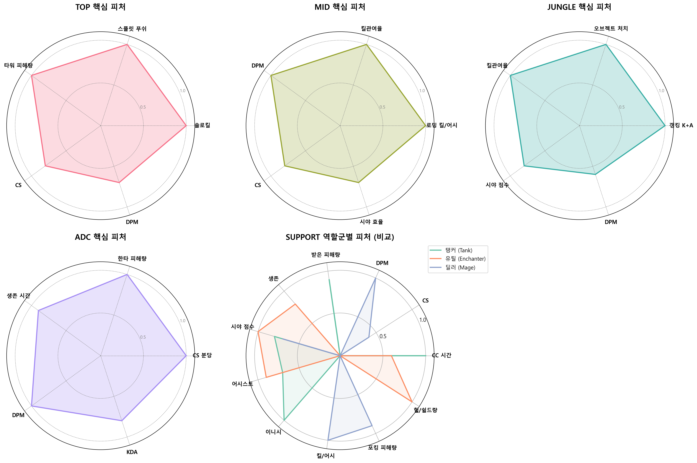
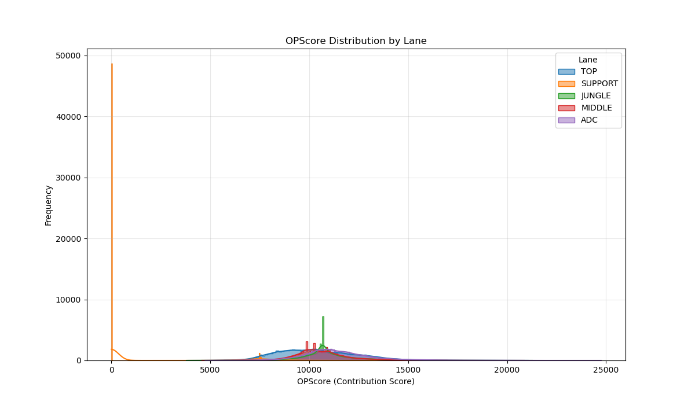

# 🎮 LOL Player Contribution Analysis
## 하이브리드 기여도 모델 (Manual Weight + CatBoost Residual)

## 1. 프로젝트 개요
이 프로젝트는 각 라인이 시간의 흐름에 따라 얼마나 기여했는지를  
“기여도 타임라인(0~N분)” 형태로 계산하는 모델을 만드는 데 목적이 있다.

단순히 골드를 예측하거나 승패를 분류하는 모델이 아니라,  
챌린저 평균(=1.0) 을 기준으로  
각 분마다 플레이어가 평균 대비 얼마나 잘했는지를 정량화하는 방식이다.

---

## 2. 이 프로젝트에서 가장 중요한 차별점

### ✔ 1) 피처를 15분 전 / 15분 후 / 종료시점의 3개 모델로 분리

- Early Model (0–15분): 라인전 중심  
- Late Model (15분~): 팀파이트 중심  
- End Model (종료 스냅샷): match.json의 정적 피처 활용  

이렇게 분리하면 원래는 한 번만 볼 수 있는 정적 데이터(match.json)도  
시계열 모델 안에 자연스럽게 넣을 수 있게 된다.

즉, 정적 데이터를 시계열처럼 활용하는 구조를 만들었다는 점이 중요한 차별점이다.

---

### ✔ 2) 수동 가중치(manual weight) + CatBoost 자동학습(residual)의 하이브리드 방식

골드를 Y값으로 두면 gold/min, cs/min 같은 피처들이  
과도하게 큰 가중치를 얻는다.

하지만 롤에는 수치로 안 보이는 중요한 행동들이 많다.

- 포지셔닝  
- 무빙 압박  
- 생존 시간  
- 팀과의 거리 유지  
- 시야 플레이  

그래서 중요한 피처는 내가 직접 가중치를 준다.

그리고 나머지는 CatBoost가 자동으로  
manual weight가 놓친 비선형 패턴을 보완하도록 했다.

```
final_score_t = manual_score_t + catboost_residual_t
```

→ 사람이 게임 이해로 뼈대를 만들고  
→ 머신러닝이 빈 부분을 채우는 구조.

---

### ✔ 3) 서포터 모델을 4개의 역할군으로 분리

대부분은 바텀(ADC+SUP)을 하나로 묶지만,  
서폿 역할군이 너무 다양하다는 점을 문제로 봤다.

그래서 직접 크롤링 후 support_role.py로 네 가지 역할로 분리했다.

- Enchanter  
- Tank  
- Mage(딜서폿)  
- Assassin(픽형)  

이 작업 덕분에 원딜과 서폿을 분리하여 모델링할 수 있었고  
해석력이 크게 향상됐다.

---

## 3. 라인별 Manual Feature 선정 이유

### 🟦 공통 피처
| 피처 | 이유 |
|------|------|
| cs per minute | 라인전 경쟁력 핵심 |
| xp | 성장 속도 |
| vision score | 맵 주도권 |
| dpm | 후반 기여도 |
| deaths | 생존 |
| kill/assist | 직접 영향력 |

---

### 🟥 TOP
| 피처 | 이유 |
|------|------|
| 솔로킬 | 라인전 실력 |
| 포탑 방패 | 압박 |
| turret takedown | 스플릿 성공 |
| 스플릿 시간 | 매크로 |
| 데스당 받은 피해량 | 탱킹 효율 |

---

### 🟩 MID
| 피처 | 이유 |
|------|------|
| 로밍 K+A | 판도 변화 |
| 포탑 방패 | 라인전 우위 |
| 시야 | 양 강가 관리 |

---

### 🟫 JUNGLE
| 피처 | 이유 |
|------|------|
| 오브젝트 | 실제 가치 |
| 갱킹 K+A | 개입력 |
| 갱 시도 | proactive |
| 상대 정글 체류 | 압박 |

---

### 🟦 ADC
| 피처 | 이유 |
|------|------|
| 킬당 받은 피해량 | 포지셔닝 |
| 데스당 넣은 피해량 | 죽어도 딜 |
| 팀파이트 딜량 | 캐리력 |
| death timer | 후반 영향 |

---

### 🟪 SUPPORT  
**공통**
- 시야  
- 제어 와드  
- assist  
- roam  
- CC 기여시간  

**Enchanter**
- heal/shield  

**Tank**
- 데스당 피격량  
- CC 맞춘 횟수  

**Mage**
- DPM  

**Assassin**
- pick/발견 능력  

---

## 4. 전체 Pipeline 구조

1. timeline 데이터 준비  
2. 0~N분 피처 추출  
3. 챌린저 median=1 정규화  
4. early/late/end 구간 분리  
5. manual weight 적용  
6. CatBoost residual 학습  
7. final_score 생성  
8. 기여도 타임라인 생성  
9. 라인/소환사 분석  

---

# 📊 5. 시각화 결과 및 그래프로 알 수 있는 점

---

## 📌 (1) Feature Definition Radar  
**파일명:** feature_definition_radar.png  
**스크립트:** visualize_feature_radar.py  
**폴더:** visualizations/

```

```

### 🔍 알 수 있는 점
- 라인별 핵심 피처가 시각적으로 정리됨  
- manual weight 철학 설명 가능  
- 역할군 특성이 명확히 보임  

---

## 📌 (2) CatBoost Feature Importance  
**파일명 패턴:** importance_<model>.png  
**스크립트:** plot_feature_importance.py  
**폴더:** visuals/

```

```

### 🔍 알 수 있는 점
- CatBoost가 실제로 중요하게 보는 피처 확인  
- manual weight vs model weight 비교  
- 라인/시간대별 메타 해석 가능  

---

## 📌 (3) OPScore 분포도  
**파일명:** opscore_distribution.png  
**스크립트:** visualize.py  
**폴더:** visuals/

```

```

### 🔍 알 수 있는 점
- 라인별 분포/편차 비교  
- 기여도 안정성 판단  
- 챌린저 평균을 기준으로 분포 확인  

---

## 📌 (4) Early vs Late Comparison  
**파일명:** early_late_comparison.png  
**스크립트:** early_late_comparison.py  
**폴더:** visualizations/

```

```

### 🔍 알 수 있는 점
- 초반 vs 후반 강함 비교  
- 시간대별 역할 변화 파악  
- 후반 캐리형 라인 식별 가능  

---

## 📌 (5) Feature Distribution Plot  
**파일명:** feature_distribution_plot.png  
**스크립트:** feature_distribution_plot.py  
**폴더:** visualizations/

```

```

### 🔍 알 수 있는 점
- 분포/이상치/메타 특징 확인  
- manual weight 근거 설명  

---

## 📌 (6) Match Curve (EWMA)  
**파일명:** match_curve_<gameid>.png  
**스크립트:** match_curve.py  

```

```

### 🔍 알 수 있는 점
- 시간에 따른 기여도 흐름  
- 경기 전환점 분석  
- 오브젝트-기여도 관계 분석  

---

## 📌 (7) Match Pair Curve  
**파일명:** match_pair_curve_<gameid>.png  
**스크립트:** match_pair_curve.py  

```

```

### 🔍 알 수 있는 점
- 5라인 기여도 직관적 비교  
- 캐리 여부 명확히 드러남  
- 상성/갱 영향력 분석에 유리  

---

## 📌 (8) PCA Cluster Map  
**파일명:** pca_cluster_map.png  
**스크립트:** pca_cluster_map.py  

```

```

### 🔍 알 수 있는 점
- 플레이 스타일 클러스터링  
- 안정형/폭발형/후반형 등 유형 분류  
- 라벨 없이 패턴만으로 구분되는지 확인  

---

## 📌 (9) Summoner Consistency  
**파일명:** consistency_<summoner>.png  
**스크립트:** summoner_consistency.py  

```

```

### 🔍 알 수 있는 점
- 소환사의 경기별 일관성  
- 승패와 기복 관계  
- 안정형 vs 변동형 플레이어 분석  

---

## 📌 (10) Win/Loss Radar  
**파일명:** winloss_radar.png  
**스크립트:** winloss_radar.py  

```

```

### 🔍 알 수 있는 점
- 승리팀/패배팀 차이 시각화  
- 라인별 승패 결정 요인 파악  
- 전략적 분석 가능  

---

# 🎯 결론

이 프로젝트는

- 3구간 모델(Early/Late/End)  
- 서포터 역할군 분리  
- Manual Weight + CatBoost Residual  
- Challenger median 정규화  
- 분당 기여도 타임라인 생성  

이라는 구조로 설계된  
가장 현실적인 **라인 기여도 분석 모델**이다.

